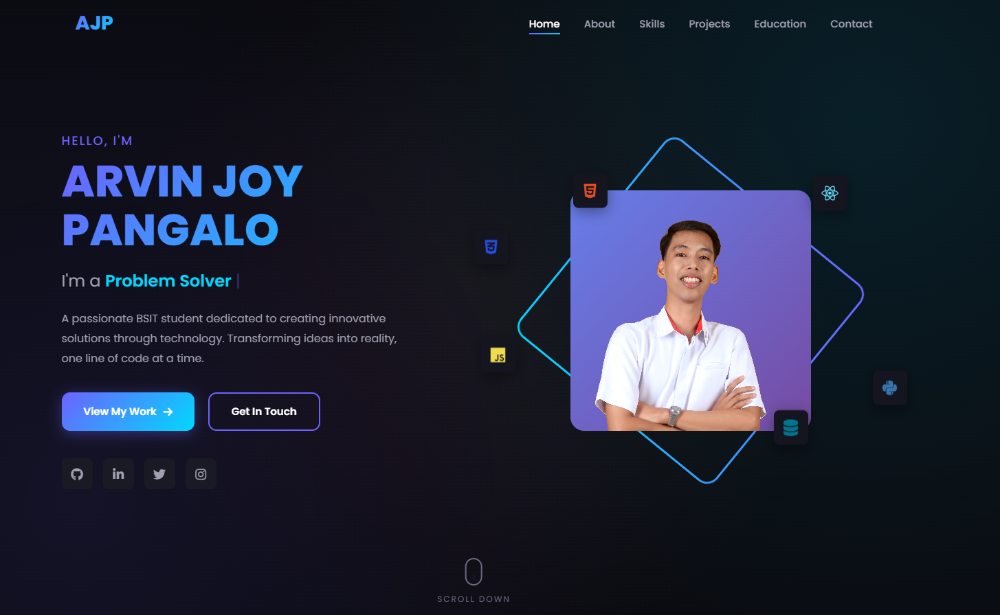

# 👋 Welcome to My Portfolio

## About Me

Hi, I'm **AJ Pangalo** — a passionate **Web Developer**, **UI/UX Designer**, and **Tech Enthusiast** from the Philippines. I'm currently a 3rd-year Computer Science student at Pamantasan ng Lungsod ng Maynila (PLM), driven by curiosity and a love for building things that make a difference.

## 🌐 Live Site

🔗 **[View My Portfolio](https://aj-tech-24.github.io/portfolio)**

## ✨ What You'll Find Here

- **About Me** — My journey, passions, and what drives me
- **Skills** — Technologies and tools I work with
- **Projects** — Real-world applications I've built
- **Education** — My academic background and certifications
- **Contact** — Let's connect and collaborate!

## 🚀 Featured Projects

### Miniway 2.0
A real-time public transport tracking and digital ticketing system designed for informal mini bus operations. Transforming uncertainty into clarity for commuters, drivers, conductors, and operators.

### Miniway Admin Dashboard
A comprehensive web-based admin panel for managing routes, monitoring fleet analytics, and overseeing ticketing operations.

## 📜 Certifications

- 🔐 Introduction to Cybersecurity — Cisco Networking Academy
- 💻 HTML, CSS, JavaScript, React — Udemy
- 🎨 Software Development & Design Thinking
- ⚡ Vibe Coding with AI

## 📬 Get In Touch

I'm always open to new opportunities, collaborations, or just a friendly chat about tech!

- 📧 **Email:** ajPangalo.work@gmail.com
- 💼 **LinkedIn:** [AJ Pangalo](https://linkedin.com/in/aj-Pangalo-a16aborj)
- 🐙 **GitHub:** [aj-tech-24](https://github.com/aj-tech-24)
- 📘 **Facebook:** [AJ Pangalo](https://facebook.com/ajborrj)

---

  <i>✨ "Turning ideas into reality, one line of code at a time." ✨</i>

  Made with 💜 by AJ Pangalo

